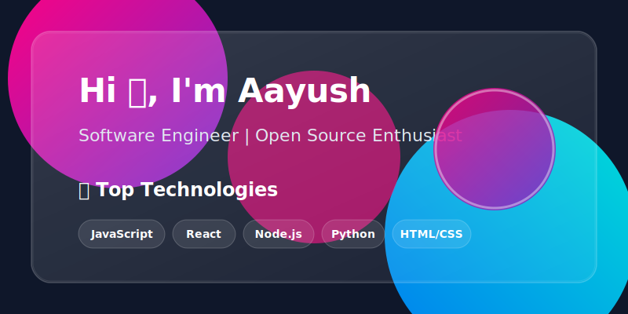

  

 

  <h2>Welcome to my GitHub profile! 🚀</h2>
  
I'm a passionate developer building modern, beautiful, and performant applications.

   

  <h3>🛠️ Tools & Technologies</h3>
  

    
    
    
    
  

   

  <h3>📊 GitHub Stats</h3>
  

    
  

